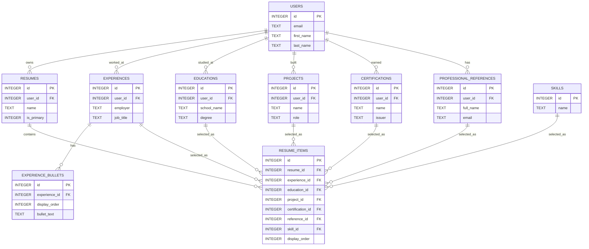

# Resume Builder Database Design

## Scope

This database is for job seekers who have one career history but want to apply to different kinds of roles. The main problem I designed around is duplication. A lot of resume builders make each resume its own separate set of data. That means if the same job appears on three resumes, the user may have to copy the job three times and later update it three times, and the three copies can drift out of sync.

This schema is meant to be a multi-resume builder where one user maintains a single canonical career history and assembles tailored resumes by selecting which experiences, skills, projects, credentials, education records, and references appear on each resume.

The database does not handle PDF rendering, public sharing, resume templates, social features, version history, or a full authentication flow. Those are application features, and I kept them out so the database stays focused on storing and selecting resume content.

## Functional Requirements

A user can create an account and store basic profile information such as name, contact fields, links, a headline, and a default professional summary. A user can maintain one canonical set of career records instead of recreating the same jobs, schools, projects, certifications, references, and skills for every resume.

A user can create multiple named resumes. Each resume can include any subset of the user's career items by adding rows to `resume_items`. Items can be ordered with `display_order`, so the same content can appear in a different order on different resumes. A user can also mark a resume as primary, although that rule is handled by application logic rather than fully enforced by the database.

The schema supports updating or deleting career items. Foreign keys with `ON DELETE CASCADE` clean up dependent rows, especially rows in `resume_items`, when a parent item is removed. The system does not render resumes to PDF, manage versions, or publish resumes publicly.

## Representation

The `users` table stores account-level information and profile fields that are shared across resumes. I put fields like `headline`, `professional_summary`, `city`, `state_region`, `country`, and profile URLs here because they usually belong to the person, not to one specific resume. The `email` field is `UNIQUE`, which supports login and prevents duplicate accounts with the same email. I also added a simple `LIKE` check for email shape. It is not perfect email validation, but it catches obviously bad values without making the schema too complicated. The table stores `password_hash`, not a plaintext password. The full login process is outside the scope of this project, but the column shows that passwords should not be stored directly.

The `resumes` table represents the different resume versions a user wants to build. Each resume belongs to one user through `user_id`. The pair `UNIQUE (user_id, name)` prevents one user from having two resumes with the same name, while still allowing two different users to both have a resume called `Default` or `Software Engineer`. I added `target_role` because each resume is usually aimed at a particular job type. I added `summary_override` because the user's default summary might be too general, and a targeted resume may need a more specific summary. The `is_primary` column is a simple boolean-style integer. I did not enforce exactly one primary resume per user in the database, which is a limitation I describe later.

The `experiences` table is the most important example of the main design choice: experiences belong to a user, not to a resume. A simpler but worse design would attach experiences directly to resumes. That would duplicate the same job across every resume that includes it. By storing experiences at the user level, one job fact lives in one place, and resumes only choose whether to show it. `employment_type` has a `CHECK` constraint because I wanted common values like `full-time`, `part-time`, `contract`, and `internship` to keep values from drifting like 'full time' vs 'fulltime' vs 'Full-time'. Dates are stored as text in SQLite format, and the `date()` checks make sure the values are valid dates. I did not add an `is_current` column because it would repeat information already stored by `end_date`. A job is current when `end_date IS NULL`.

The `experience_bullets` table separates job bullets from the main experience row. This is the clearest normalization choice in the design. Bullets have their own order, and they may need their own querying or counting later. If I stored all bullets as one newline-separated text value inside `experiences`, the database could not easily sort them, count them, or manage them one at a time. Keeping bullets in their own table makes the data easier to work with, even though it adds one extra table.

The `educations`, `projects`, `certifications`, and `references` tables follow the same basic pattern as `experiences`: they belong to the user, not to a resume. That keeps the canonical career history in one place. Each table has constraints that fit its data. Education has a GPA range check. Projects and education allow optional dates but still check date format and date ordering when dates are present. Certifications require an issue date and make sure an expiration date, if present, is not before the issue date. References include a simple email-format check. The table name `references` is quoted because `PROFESSIONAL_REFERENCES` is a SQL keyword, and quoting it avoids confusion for SQLite.

The `skills` table is a master catalog of skill names. It is not scoped to a user. I chose that because a skill like `SQL` or `Python` should be one shared row, not a separate row for every user who has that skill. The `UNIQUE COLLATE NOCASE` rule means `Python` and `python` are treated as the same skill. That matters for queries like “find all users with SQL” because inconsistent capitalization should not split the results. I did not put `proficiency_level` or `years_experience` in `skills` because those are not facts about the skill itself. They are facts about how a specific resume presents that skill.

The `resume_items` table is the junction table that decides what appears on each resume. It has one required `resume_id` and six nullable foreign keys: one each for experience, education, project, certification, reference, and skill. A `CHECK` constraint makes sure exactly one of those six item columns is filled in for each row. I chose this over a looser design with `item_type` and `item_id` columns because I wanted real foreign keys. With the current design, SQLite can stop invalid references and can cascade deletes. For example, if an experience is deleted, related `resume_items` rows are cleaned up automatically. With only `item_type` and `item_id`, the database would not know which table `item_id` points to, so it could not enforce that relationship. The tradeoff is that `resume_items` is wider and has several nullable columns. I accepted that because correctness felt more important than making the table look smaller. The table also keeps `proficiency_level` and `years_experience` for skills because those values can change by resume. A user might present the same skill differently for a manager resume than for a technical resume. The `UNIQUE (resume_id, X_id)` constraints stop the same item from being added twice to the same resume.

## Optimizations

I added three explicit indexes. `idx_experiences_user_id` supports the common query “show me this user's career history.” Most pages in this app start with a user and then load that user's records, so indexing `experiences(user_id)` is useful. `idx_experience_bullets_experience_id` supports fetching bullets for a specific job. `idx_resume_items_resume_order` supports rendering a resume because the app filters by `resume_id` and sorts by `display_order`.

There are also useful indexes created implicitly by `UNIQUE` constraints. `users(email)` helps account lookup, and `skills(name)` helps skill lookup. The `v_resume_full` view flattens the six possible item types into one renderable result, so the app does not need six separate queries just to display a resume. The `v_career_summary` view gives per-user totals for experience, jobs, and skills, which is helpful for dashboards.

I did not add triggers, generated columns, partial indexes, or full-text search. Those could be useful later, but I left them out to keep the schema easier to understand.

## Limitations

This design has real weaknesses. There is no version history, so when a user edits a job or bullet, the old value is lost. The rule “exactly one primary resume per user” is not enforced by SQLite here; the application has to handle it. `v_career_summary` adds up date ranges and does not account for overlapping jobs, so someone working two jobs at the same time gets double-counted. The `resume_items` table is wider than ideal because it has six nullable foreign keys. Six separate junction tables would be cleaner per table, but it would also add more tables and more repeated query logic. There is no full-text search across resume content. `password_hash` exists, but there is no actual auth flow. Also, `v_resume_full.subtitle` means different things for different item types, so a real renderer would need type-aware display logic.

## ERD

